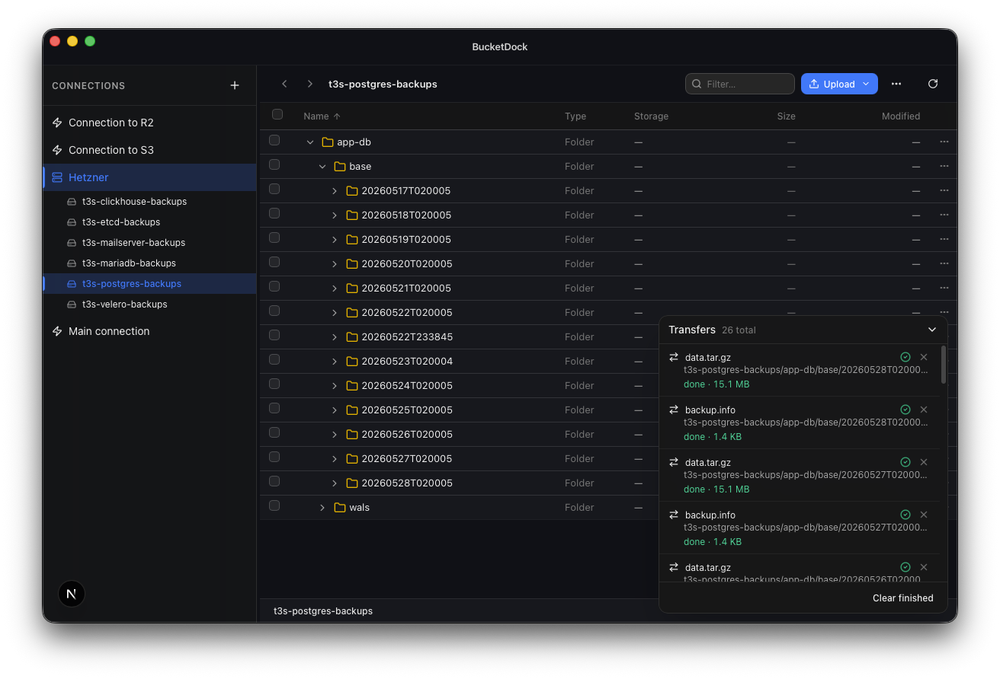
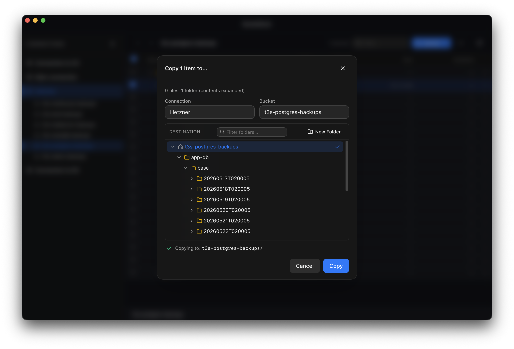

#  BucketDock

**BucketDock — your S3 browser, on your macOS desktop.**

BucketDock is built for AWS S3, Cloudflare R2, Hetzner Object Storage, and other S3-compatible providers when you want a desktop UI instead of the CLI or a browser dashboard.




## macOS notice

This is an unsigned developer-preview build. It is not signed with Apple Developer ID and is not notarized.

macOS may say: "the app is damaged or cannot be opened". To run it:

```bash
xattr -dr com.apple.quarantine /Applications/BucketDock.app
open /Applications/BucketDock.app
```

For screenshots and step-by-step first-launch help, see the
[download and install guide](https://bucketdock.com/install.html).

### macOS Gatekeeper note

Current builds are ad-hoc signed but not Apple-notarized. macOS may block them after download. This is expected for early developer-preview builds.

Official signed and notarized builds are planned later.

## Implemented Features

### Connections

- Multiple saved connections
- Providers: AWS S3, Cloudflare R2, Hetzner Object Storage, generic S3-compatible endpoints
- Connection testing from the UI
- Optional fixed bucket list for scoped credentials
- Edit and delete connection profiles

### Bucket And Object Browsing

- Bucket sidebar per connection
- Folder-like navigation over object prefixes
- Folder rows have a Finder-style disclosure triangle (>) that expands the folder inline and lists its children indented under the parent — without navigating into the folder
- Multi-select in the current listing
- Context menus for common actions
- Empty states and loading skeletons
- Inline filter box in the toolbar (case-insensitive substring match)
- Sortable columns: Name, Type, Storage Class, Size, Modified
- The Name column is resizable so long filenames and folder names do not force the table wider than needed
- Type column shows the real `Content-Type` returned by the server (fetched via batched HEAD requests after the listing loads); it falls back to the default S3 type (`application/octet-stream` for files, `—` for folders) until the HEAD response arrives
- Per-row actions menu (…) for keyboard- and mouse-friendly access
- Modified column shows a short relative time with a full timestamp on hover
- Right-pane Finder-style bucket grid when a connection is selected without a bucket

### Object Operations

- Upload files
- Upload folders recursively
- Drag-and-drop file upload into the current prefix
- Download a file
- Download multiple selected items
- Download folders recursively
- Create folder placeholder objects
- Rename objects (use a slash to move into a sub-prefix in the same bucket, e.g. `images/photo.jpg`)
- Rename / move folders (copy-and-delete across an entire prefix)
- Delete single objects
- Delete multiple selected objects
- Delete prefixes recursively
- Delete confirmation lists every item that will be removed
- Open a file through a presigned URL
- Inline preview for images, audio, video, PDFs, and text files
- Copy files between buckets, including across different connections and providers
- Copy whole folders between buckets (recursive multi-file copy)
- Move files and folders between buckets (copy-then-delete-source, where each
  source is removed only after its own copy completes — partial / failed /
  cancelled transfers leave the source untouched)
- Copy / Move destination picker with a folder tree, lazy-expanded children
  on click, and an inline "New Folder" action so you can carve out a fresh
  destination without leaving the dialog
- Calculate folder size recursively across all nested subfolders from the folder context menu

### Transfer Queue

- Background queue for uploads, downloads, and bucket-to-bucket copies
- Per-transfer status (running, done, failed, cancelled)
- Live progress bar for uploads (per-part for multipart), downloads, and copies
- Cancel a running transfer
- Retry a failed transfer
- Dock at the bottom-right with collapse and clear-finished actions

### Metadata

- View object size, modified time, ETag, storage class, and key
- Dedicated "Get Info" view (read-only) and a separate "Edit Headers" editor
- Edit Content-Type
- Edit Cache-Control
- Edit Content-Disposition
- Edit Content-Encoding
- Edit Content-Language
- Edit custom user metadata

### Desktop Behavior

- Native macOS window via Tauri
- Native macOS application menu (File, Edit, View, Window, Help) with standard ⌘ accelerators and links to website / docs / GitHub
- Window draggable from the titlebar zone
- Native file and directory pickers
- macOS Keychain secret storage
- Light and dark appearance support
- Persistent sidebar width
- Persistent selected connection, bucket, and prefix state
- Friendly error messages on connection test / save (recognises `AccessDenied`, `SignatureDoesNotMatch`, `InvalidAccessKeyId`, `NoSuchBucket`, network failures)

## Not Implemented Yet

The following items are not implemented in the current codebase and should not be treated as shipped features:

- object tags
- Finder reveal or open-downloaded-file action
- bucket policy inspection

## Keyboard Shortcuts

Current object browser shortcuts:

- `Delete` or `Backspace` with a selection: delete selected items
- `Enter` with one selected folder: open that folder
- `Cmd+A` or `Ctrl+A`: select all visible items
- `Cmd+I` or `Ctrl+I`: open info for one selected file

## Architecture

BucketDock uses a split desktop architecture:

```text
Next.js frontend
  -> Tauri command bridge
    -> Rust backend
      -> AWS SDK for S3 / R2 / Hetzner / compatible providers
```

The frontend never talks directly to S3.

All storage requests are executed by the Rust backend through Tauri commands. That keeps request signing logic and secrets out of the browser runtime.

## Local Data And Secrets

Connection metadata is stored in:

```text
~/Library/Application Support/BucketDock/connections.json
```

Stored there:

- connection name
- provider
- endpoint
- region
- access key id
- optional bucket list

Secret access keys are stored separately in the macOS Keychain under the service name:

```text
com.bucketdock.app
```

If a connection was created before native Keychain persistence was enabled, edit that connection, enter the Secret Access Key again, and save it once so the secret is written into the macOS Keychain.

## Development

### Prerequisites

- macOS
- Node.js
- pnpm
- Rust
- Tauri prerequisites for macOS

Tauri setup instructions:

https://tauri.app/start/prerequisites/

### Install Dependencies

```bash
pnpm install
```

### Run The Desktop App

```bash
pnpm tauri dev
```

This starts the Next.js frontend on port `1420` and launches the Tauri shell.

### Run Only The Frontend

```bash
pnpm dev --port 1420
```

This is useful for UI work, but storage operations require the Tauri shell and Rust backend.

### Build

```bash
pnpm tauri build
```

The Next.js frontend is exported to `out/`, and Tauri bundles the macOS app from there.

Build artifacts are written under:

```text
src-tauri/target/release/bundle/
```

### Useful Backend Check

```bash
cargo check --manifest-path src-tauri/Cargo.toml
```

### Tests

The project ships two suites that both run in CI before any release build:

```bash
# Frontend unit tests (Vitest + jsdom): IPC bridge, app store, copy-to
# self-overwrite guard, MIME helper, secret-leak invariants.
pnpm test

# Backend unit tests (Rust): connection metadata round-trip, validation,
# bucket-filter parsing, S3 key percent-encoding, rename_prefix edges,
# keychain service / bundle account constants.
cargo test --manifest-path src-tauri/Cargo.toml
```

## Provider Setup

### AWS S3

Typical AWS S3 setup:

```text
Provider: AWS S3
Region: eu-central-1
Endpoint: leave empty
Buckets: leave empty to auto-list, or set one or more names
```

### Cloudflare R2

Use the account endpoint and keep the bucket name separate.

Standard R2 setup:

```text
Provider: Cloudflare R2
Endpoint: https://<ACCOUNT_ID>.r2.cloudflarestorage.com
Region: auto
Buckets: your-bucket-name
```

If you have access to more than one bucket, the `Buckets` field can contain a comma-, space-, newline-, or semicolon-separated list.

Important rules:

- Do not append the bucket name to the endpoint URL
- Keep region set to `auto`
- For bucket-scoped credentials, enter the exact bucket name in the `Buckets` field
- For jurisdiction-specific R2 endpoints, paste the full endpoint manually

Correct:

```text
Endpoint: https://<ACCOUNT_ID>.r2.cloudflarestorage.com
Buckets: media-assets
Region: auto
```

Incorrect:

```text
Endpoint: https://<ACCOUNT_ID>.r2.cloudflarestorage.com/media-assets
Buckets: media-assets
Region: auto
```

### Generic S3-Compatible Providers

Example:

```text
Provider: S3-Compatible
Endpoint: https://s3.example.com
Region: us-east-1
Buckets: my-bucket
```

### Hetzner Object Storage

Example:

```text
Provider: Hetzner Object Storage
Endpoint: https://fsn1.your-objectstorage.com
Region: hidden in the form
Buckets: my-bucket
```

## Troubleshooting Cloudflare R2

### SignatureDoesNotMatch

If opening a bucket fails with an error like:

```text
Failed to list objects: S3 error: service error: unhandled error (SignatureDoesNotMatch)
```

check the following first:

1. The endpoint must be the account endpoint, not an endpoint with the bucket appended.
2. The region must be exactly `auto`.
3. The bucket name must be entered separately in the `Buckets` field.
4. If the credentials are scoped to one specific bucket, that bucket must be listed explicitly.
5. Remove any trailing spaces from endpoint, access key id, bucket name, and secret.

For bucket-scoped R2 credentials, BucketDock skips the account-wide `ListBuckets` call and uses the configured bucket names directly.

### Saved Connection Works Only While Editing

If typing the secret into the edit form makes `Test` pass, but testing the saved connection fails, the saved secret is missing. Open `Edit Connection`, enter the Secret Access Key again, and click `Save` so BucketDock can write it into the macOS Keychain.

## License

BucketDock source code is licensed under the Apache License, Version 2.0.

See [LICENSE](./LICENSE) for details.

The BucketDock name, logo, icon, domain, and official release assets are not licensed for use in a way that suggests endorsement by the official project.
